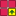
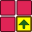
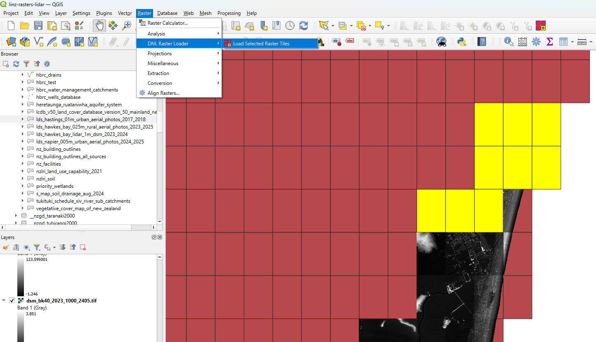

<meta charset="UTF-8"/>

  

<h1 align="center" style="font-size: 3.5em; color: #000;">
  <strong>DNL Raster Loader</strong>
</h1>
  

    <strong>Development Nous Ltd</strong>

    <em>502 Karamu Road, Hastings, New Zealand</em>

    <a href="https://www.developmentnous.nz"
        target="_blank"
        title="Open in new tab"
        style="color: #000; text-decoration: none;"
        onmouseover="this.style.color='blue';"
        onmouseout="this.style.color='#000';">
        www.developmentnous.nz
    </a>

---------------------------------------------

# Table of Contents

- [Documentation](#documentation)
- [How to Install](#how-to-install)

# Documentation

Adds a toolbar button that loads raster images from MinIO for selected tile
footprint features.

The active layer must be registered in the `__attributes.raster_dataset` PostGIS
table and must have a valid `uri` field.

Select up to 25 tiles then click the button to load them as raster layers (each
tile becomes a separate raster layer).

# How to Install

Download and save the zip file `dnl-raster-loader.zip` somewhere on your local
machine. In QGIS, go to `Plugins` 🠊 `Manage and Install Plugins…`. In the
**Plugins | All** box, click `Install from ZIP` on the left panel and in the
**Zip file** text box enter or click the browse (`...`) button to navigate to
wherever you saved the attached zip file. Once it is entered, click the `Install
Plugin` button and after QGIS confirms the plugin installed successfully, click
`Close`.

Then connect to the PostgreSQL database `geodb_nz` and under the
`__nzgd_nztm2000` schema, load up a vector tile metadata layer such as:

- `lds_hastings_01m_urban_aerial_photos_2017-_2018`
- `lds_hawkes_bay_025m_rural_aerial_photos_2023_2025`
- `lds_hawkes_bay_lidar_1m_dsm_2023_2024`
- `lds_napier_005m_urban_aerial_photos_2024_2025`

Once the layer is added, click on it and use a selector tool to select up to 25
tiles. After selecting the tiles, navigate to the plugin on the menu: `Raster`
🠊 `DNL Raster Loader` 🠊   `Load Selected Raster
files` or make sure the raster toolbar is visible and look for the
 button.

Click the button and
    ... wait a bit ...
        ... then the raster tiles will appear one by one after a message that
the tiles have been loaded pops up. The raster images will be listed in the
Layers panel above the vector tile metadata layer.

